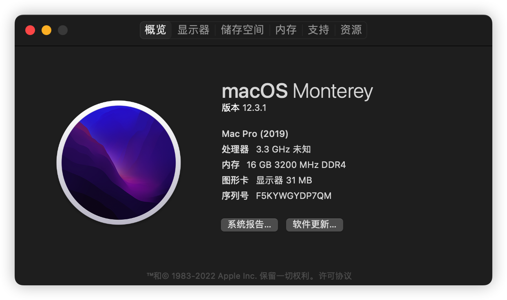

# Hackintosh-12100-MAXSUN-MS-CHALLENGER-H610M

#
适用于 12100 + 铭瑄H610M挑战者 DDR4 黑苹果引导文件

基于 OpenCore 0.8.1 版本，机型 MacPro 7,1，系统 MacOS 12.3

# 本机配置

| 配置        | 型号                 |
|-----------|--------------------|
| CPU       | intel i5 12100     |
| 主板        | 铭瑄 h610m 挑战者       |
| 显卡        | 无显卡                |
| 内存        | 金百达 3200MHz 8G * 2 |
| SSD       | wd sn750 512G      |
| WiFi + 蓝牙 | AX210 (PCI+USB转接卡) |

# 使用情况
装配intel wifi 蓝牙 kext文件 ，默认启用。非intel网卡禁用即可(Airportltlwm.kext\IntelBluetoothFirmware.kext\BrcmFirmWareData.kext)

# BIOS 配置

### 禁用：

基本上默认 bios都是关的

### 开启：
xmp自己调整
VT-x要自己开启
4G地址寻址开启